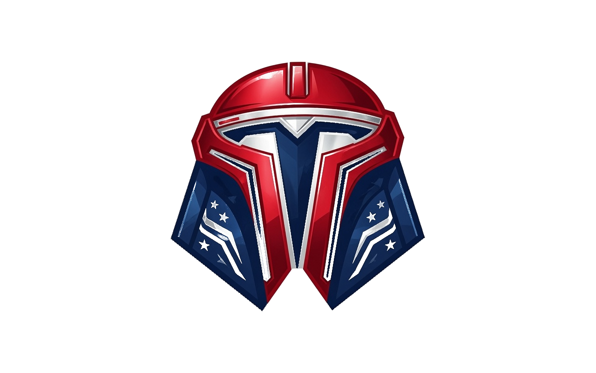
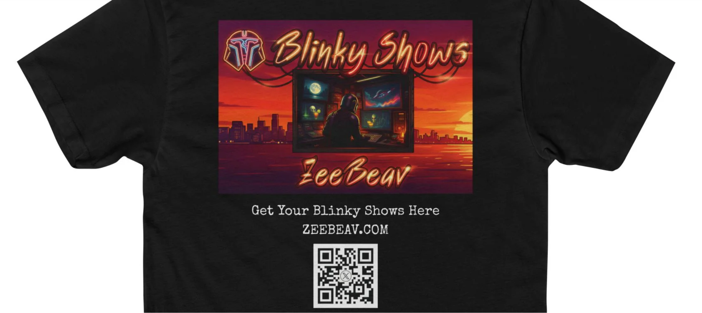

<html lang="en">
<head>
  <meta charset="UTF-8">
  <meta name="viewport" content="width=device-width, initial-scale=1.0">
  <title>ZeeBeav</title>
  
</head>
<body>

  <video class="video-bg" autoplay loop muted playsinline>
    <source src="Sequence 01_2.mp4" type="video/mp4">
  </video>

  

    <h1>ZEEBEEV</h1>
    
We do Electric. Bold. Unforgettable. Tesla Light Shows.

    
      
      

    <a href="mailto:zeebeav@gmail.com?subject=Dude, put me on the email list pls!" target="_blank" class="cta">
      JOIN THE EMAIL LIST
    </a>

    
FREE DOWNLOADS: 
      <a href="https://www.toybox.lol/zeebeav" target="_blank" class="cta">ToyBox</a>
      <a href="https://xlightshows.io/light-shows/" target="_blank" class="cta">Xlights</a>
      <a href="https://teslalightshare.io/4247/light-shows" target="_blank" class="cta">TeslaShare</a>
    

     
    <a href="https://smokehbearsden.com/products/zeebeav-blinky-shows-tee?variant=48170385080558" target="_blank" class="cta">$40 T's</a>
  

</body>
</html>
